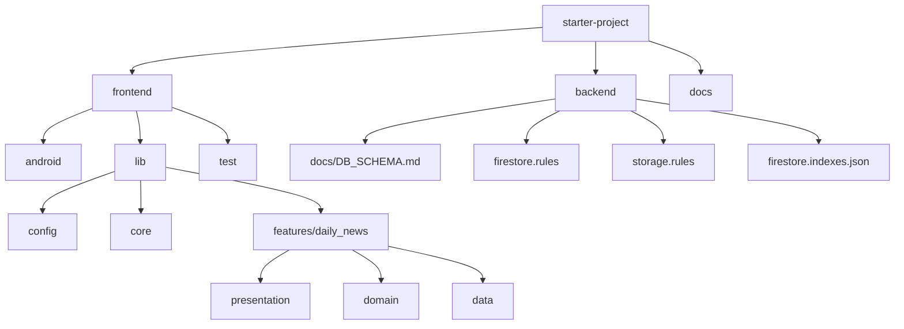
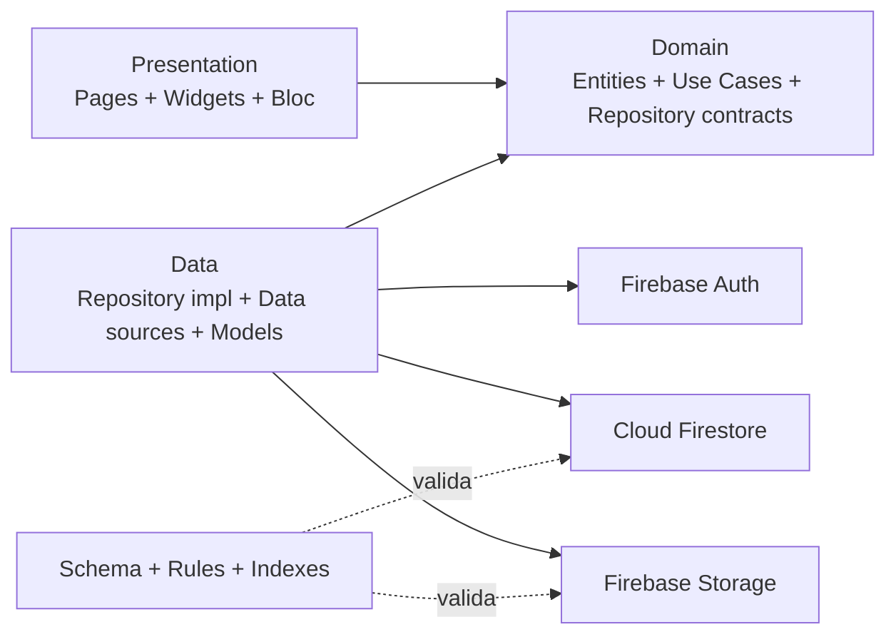
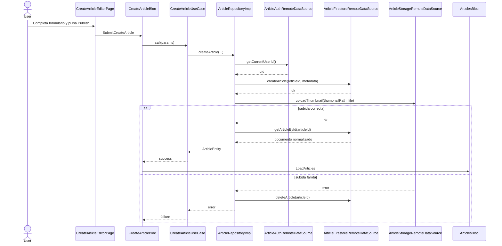

# Reporte de desarrollo

## Introduccion

Este reporte resume el trabajo realizado sobre la base del proyecto `news_app_clean_architecture` para convertirlo en un MVP funcional centrado en publicacion y consulta de articulos propios. El foco principal de esta iteracion ha sido cerrar el flujo real de articulos sobre Firebase, mantener la estructura de Clean Architecture ya definida por el repositorio y dejar documentadas las decisiones tecnicas que condicionan el estado actual del sistema.

## Alcance

### Alcance completado

- Backend sobre Firebase preparado con:
  - esquema de datos en `backend/docs/DB_SCHEMA.md`
  - reglas de Firestore en `backend/firestore.rules`
  - reglas de Storage en `backend/storage.rules`
  - indices compuestos en `backend/firestore.indexes.json`
- Frontend Android conectado a Firebase con:
  - `Firebase.initializeApp(...)`
  - `google-services.json`
  - `firebase_options.dart`
  - bootstrap tolerante si el acceso anonimo no esta habilitado
- Flujo activo del MVP:
  - cargar articulos publicados desde Cloud Firestore
  - abrir detalle por `articleId`
  - crear articulo desde editor propio
  - seleccionar miniatura con `image_picker`
  - subir miniatura a Firebase Storage
  - publicar metadatos del articulo en Cloud Firestore
  - refrescar el feed tras publicar
- Estado de aplicacion y navegacion organizados con `flutter_bloc`
- Inyeccion de dependencias productiva simplificada con `GetIt`
- Documentacion operativa actualizada en `frontend/README.md`

### Fuera de alcance actual

- Flujo de autenticacion con UI propia
- Soporte oficial para Firebase Emulator Suite desde la app
- Persistencia de `Saved Articles` entre reinicios
- Soporte productivo para iOS, web o desktop

### Estado funcional actual

- El feed principal consume articulos publicados desde Firestore.
- La publicacion crea articulo remoto y sube miniatura a Storage.
- El detalle funciona con identificador remoto real.
- `Saved Articles` funciona en memoria durante la sesion actual.

## Decisiones tomadas

| Decision | Motivo | Impacto |
|---|---|---|
| Mantener Clean Architecture (`presentation`, `domain`, `data`) | El repo ya impone esta estructura y permite aislar UI, reglas de negocio y acceso a datos | La integracion con Firebase no rompe la arquitectura existente |
| Usar el `document id` de Firestore como identificador canonico del articulo | Evita duplicar IDs y alinea Firestore, Storage y navegacion | El detalle, la subida de miniatura y las reglas se apoyan en el mismo `articleId` |
| Guardar `thumbnailPath` en vez de persistir una URL publica | La consigna pedia usar Storage y es mas robusto almacenar la referencia estable | La URL se resuelve en runtime y las reglas de Storage quedan mas claras |
| Extender el shape heredado de News API en vez de reemplazarlo por completo | Reducir refactor en la UI y reutilizar `ArticleEntity` | La presentacion sigue consumiendo un modelo cercano al existente |
| Publicar primero el documento y despues subir la miniatura | Era necesario conocer el `articleId` antes de construir la ruta `media/articles/{articleId}/thumbnail.ext` | El flujo queda ordenado y compatible con las reglas remotas |
| Hacer rollback del documento si falla la subida de la miniatura | Evitar articulos huerfanos sin imagen asociada en Firebase | El estado remoto queda mas consistente ante errores parciales |
| Calentar sesion anonima en el bootstrap cuando esta disponible | El MVP necesita autor autenticado para publicar, pero no se implemento una pantalla de login | La app puede arrancar y publicar sin UX adicional cuando Anonymous Auth esta habilitado |
| Degradar con error explicito si Anonymous Auth no esta permitido | Evitar fallos opacos en publicacion | El usuario recibe una causa concreta y la app sigue pudiendo leer |
| Limitar el DI de produccion al flujo activo del MVP | Habia wiring legado y fixtures de test que no debian mezclarse con la app real | Menos ruido, menos dependencias inactivas y rutas mas honestas |
| Mantener `Saved Articles` en memoria en esta iteracion | El objetivo principal era cerrar el flujo remoto de publicacion y lectura | La funcionalidad existe, pero no persiste al cerrar la app |

## Tecnologias

| Tecnologia | Uso principal en el proyecto |
|---|---|
| Flutter | Framework principal de la app |
| Dart | Lenguaje de la capa de dominio, presentacion y datos |
| `flutter_bloc` | Gestion de estado y coordinacion de pantallas |
| `get_it` | Inyeccion de dependencias |
| Firebase Core | Bootstrap de la app contra el proyecto Firebase |
| Firebase Auth | Identidad del autor para publicar articulos |
| Cloud Firestore | Persistencia de articulos publicados |
| Firebase Storage | Almacenamiento de miniaturas |
| `image_picker` | Seleccion de imagen para portada del articulo |
| `equatable` | Comparacion de estados y entidades |
| `intl` | Formateo y utilidades de fecha ya presentes en el proyecto |
| Android Gradle Plugin `8.11.1` | Toolchain Android actual del proyecto |
| Kotlin `2.2.20` | Toolchain Android actual del proyecto |
| JDK 17 | Version requerida para compilar el frontend Android |
| Android NDK `27.0.12077973` | Version fijada para evitar incidencias de compilacion |

### Tecnologias presentes en el repo pero no centrales en el flujo productivo actual

- `floor`
- `retrofit`
- `cached_network_image`

Estas dependencias siguen existiendo por herencia del proyecto y por posibles piezas legacy o de soporte, pero el flujo productivo documentado ahora mismo esta centrado en Firebase.

## Arquitectura

La arquitectura actual mantiene la separacion por capas y acota la produccion al flujo de articulos. `presentation` contiene pantallas, widgets y `Bloc`; `domain` define entidades, contratos y casos de uso; `data` implementa el acceso real a Firebase y encapsula la seleccion local de miniaturas.

En paralelo, el backend del repositorio actua como contrato del sistema remoto: schema, indices y reglas. Eso permite que el frontend y Firebase no queden acoplados solo por convencion, sino tambien por documentacion y validacion explicita.

### Arquitectura del repositorio

### Arquitectura logica del flujo activo

### Flujo de publicacion

## Problemas durante el desarrollo

### 1. Configuracion del emulador Android y toolchain

El primer problema practico no fue de negocio sino de entorno. Para ejecutar el frontend Android de forma estable hubo que alinear varias piezas a la vez:

- JDK 17
- Android Gradle Plugin `8.11.1`
- Kotlin `2.2.20`
- Android NDK `27.0.12077973`

Sin esa alineacion aparecian errores de build o advertencias que hacian el entorno poco fiable. La solucion fue fijar explicitamente la version del NDK y endurecer la configuracion Gradle para que el proyecto arranque siempre sobre un toolchain coherente.

### 2. Diferencia entre emulador Android y Firebase Emulator Suite

Otro punto confuso fue que "usar emulador" puede significar dos cosas distintas:

- correr la app en un dispositivo virtual Android
- ejecutar servicios locales de Firebase con Emulator Suite

La app actual funciona bien en emulador Android contra un proyecto Firebase real. Sin embargo, no esta cableada todavia para apuntar a Auth, Firestore y Storage locales mediante `useEmulator(...)`. Por eso fue importante documentar esta limitacion de forma explicita para no dar soporte por hecho donde aun no existe.

### 3. Bootstrap de Firebase y orden de arranque

Para que el flujo productivo fuese estable hubo que asegurar este orden:

1. `WidgetsFlutterBinding.ensureInitialized()`
2. `Firebase.initializeApp(...)`
3. inicializacion del contenedor de dependencias
4. `runApp(...)`

Si Firebase no se inicializa antes del DI y de los `Bloc`, las dependencias remotas quedan en un estado incierto. Separar el bootstrap en `core/firebase/firebase_bootstrap.dart` ayudo a hacer ese arranque mas claro y mantenible.

### 4. Publicacion dependiente de autenticacion

El modelo remoto exige `authorId`, asi que publicar sin usuario autenticado no era una opcion. Implementar una UX completa de login quedaba fuera del alcance, por lo que se opto por autenticacion anonima como solucion pragmatica de MVP.

El problema real fue que Firebase puede tener Anonymous Auth deshabilitado. En ese caso la app debia:

- seguir leyendo articulos publicados
- no romper el arranque
- explicar de forma clara por que la publicacion falla

La solucion fue combinar warm-up de sesion anonima cuando esta permitida con mensajes de error explicitos cuando no lo esta.

### 5. Consistencia entre Firestore y Storage

El articulo y su miniatura viven en dos sistemas distintos. Eso abre la puerta a inconsistencias parciales:

- documento creado sin imagen
- imagen subida sin documento valido

Se resolvio creando primero el documento con un `thumbnailPath` determinista y haciendo rollback si la subida de la miniatura falla. No es una transaccion distribuida completa, pero para el alcance del MVP reduce mucho la suciedad remota.

### 6. Separar codigo activo de wiring legado

El repositorio heredaba piezas de fases anteriores y utilidades de test. Mantener todo eso mezclado en la configuracion productiva hacia mas dificil entender que parte de la app era realmente la vigente. Por eso se redujo el contenedor de dependencias y la tabla de rutas al flujo real del MVP: feed, detalle, creacion y guardados.

## Verificacion actual

En el estado actual de la rama:

- `flutter analyze` pasa correctamente
- la bateria de tests del flujo `daily_news` pasa correctamente

Ademas, el `frontend/README.md` deja documentado un smoke test manual para validar:

- carga del feed
- detalle de articulo
- guardado y borrado en sesion
- creacion y publicacion
- comportamiento cuando Anonymous Auth no esta habilitado

## Limites conocidos y siguientes pasos

- Anadir soporte explicito para Firebase Emulator Suite desde el bootstrap.
- Persistir `Saved Articles` en almacenamiento local real si se quiere conservar entre reinicios.
- Incorporar autenticacion con UI propia si el producto deja de apoyarse en acceso anonimo.
- Extender el soporte productivo mas alla de Android cuando la configuracion Firebase multiplataforma este completa.

## Conclusion

El resultado de esta iteracion es un MVP mucho mas honesto y mas cercano a produccion que el punto de partida: ya no se trata solo de pintar una UI, sino de un flujo funcional de lectura y publicacion de articulos respaldado por Firebase, con reglas remotas, arquitectura mantenida, documentacion actualizada y limites tecnicos explicitados.
